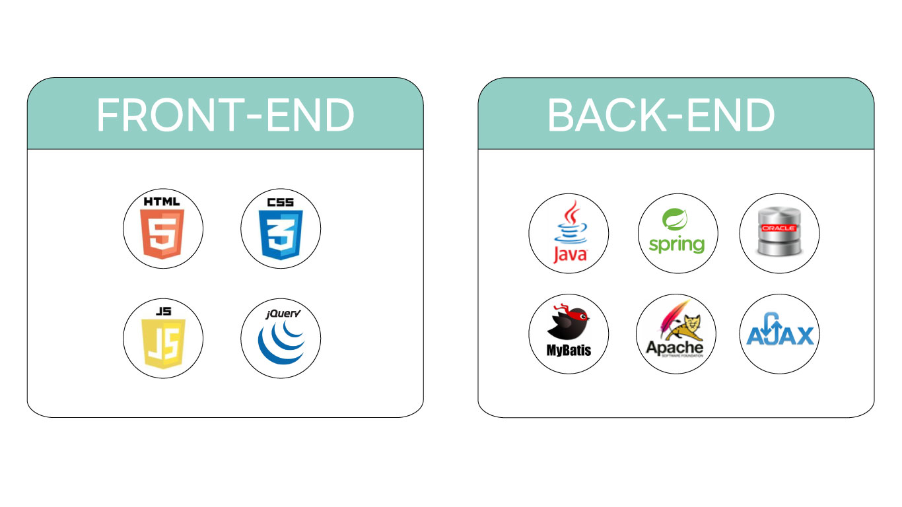
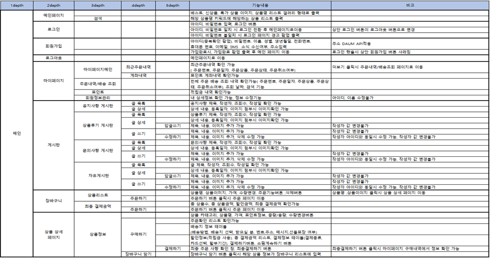
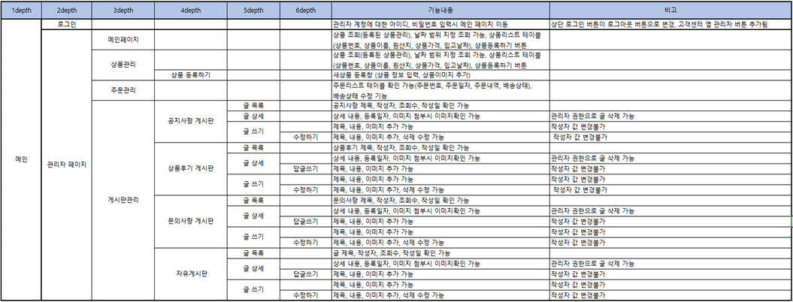

# Spring Project

## 🗓️프로젝트 개요

- **진행 기간 : 2023.01.09 ~ 2022.01.30 (3주)**
- **목표**
  - MVC 패턴을 기반으로 Spring Framework를 이용하여 운동화 쇼핑몰 제작
  - 사용자 : 온라인으로 제품을 구매
    관리자 : 상품조회, 추가, 수정등이 가능
    
     
 
## :wrench: 기술 스택

     
1. tomcat Server: Apache Tomcat 9
2. Oracle: 11.2.0
3. Spring: 4.3.9.22
4. java: 11
5. Mybatis: 3.4.6
6. HicariCP: 2.7.4
    
     
 
## 👯팀원 정보 및 업무 분담 내역

김진현 - 서버 개발

고세연 - 디자인, PPT제작, 프론트엔드, 노션, 클래스다이어그램, 서버개발

안병호 - 서버 개발, ERD다이어그램

유세영 - 디자인, 깃허브, README, 프론트엔드, 유스케이스다이어그램, 서버개발

정상원 - 서버 개발
    
     
 
## :clipboard: 요구사항명세서

### :unlock: 사용자

### :lock: 관리자

    
     
 
## :file_folder: 발표 자료

https://www.miricanvas.com/v/11pnl9f
    
     
 
## :information_desk_person: 시연 영상

## :video_camera: 광고 영상
    
     
 
## :computer: 서비스 내용

  

### :unlock: 사용자 (회원가입)
 

  

### :unlock: 사용자 (로그인)
 

  

### :lock: 관리자 (로그인)
 

  

### :lock: 관리자 (상품등록)
 

  

## 유스케이스 다이어그램
 

  

## 시퀀스 다이어그램
 

  

## ERD
 

  

