# Spring Project

## 🗓️프로젝트 개요

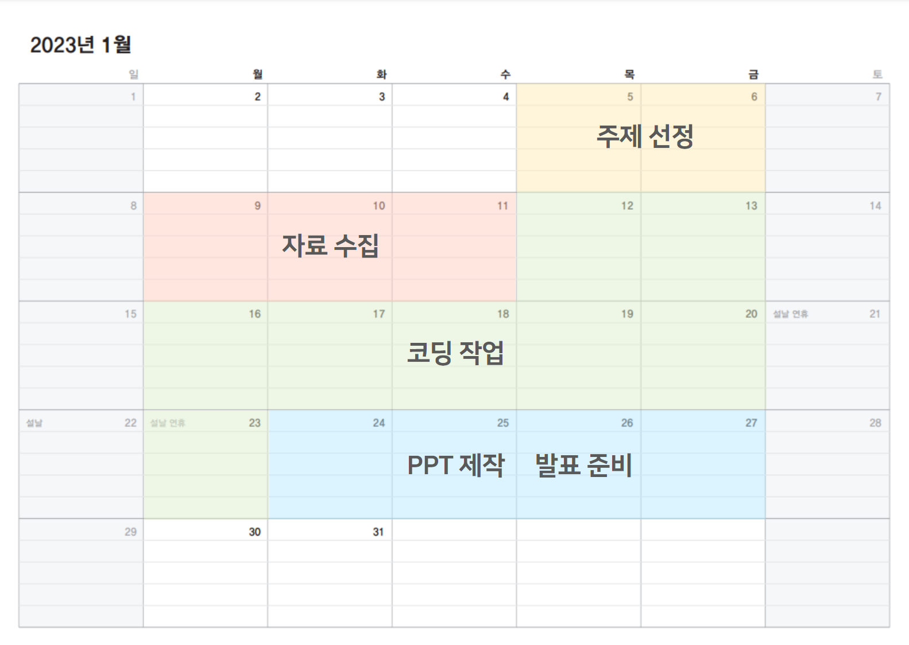

- **진행 기간 : 2023.01.09 ~ 2022.01.30 (3주)**
- **목표**
  - MVC 패턴을 기반으로 Spring Framework를 이용하여 운동화 쇼핑몰 제작
  - 사용자 : 온라인으로 제품을 구매
    관리자 : 상품조회, 추가, 수정등이 가능
    
     
 
## :wrench: 기술 스택

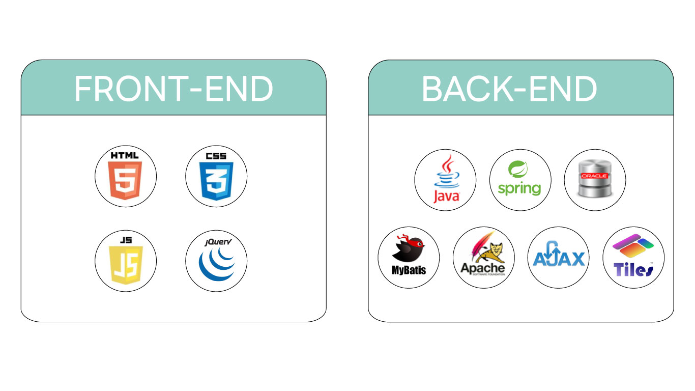
 

1. 
   
   
   
2.  11
3.  4.3.9.22
4.  11.2.0
5.  tomcat Server 9
6.  3.4.6
7.   2.2.2
8. 

    
     
 
## 👯팀원 정보 및 업무 분담 내역

공통 - 게시판 기능구현, 카테고리 기능구현

김진현 - DB관리, 주문기능구현, 서버개발, 발표

고세연 - 디자인, PPT 제작, 프론트엔드, 노션, 시퀀스다이어그램, 마이페이지기능구현

안병호 - DB관리, 관리자기능구현, ERD다이어그램, 서버개발

유세영 - 디자인, 깃허브, README, 프론트엔드, 유스케이스다이어그램, 장바구니기능구현, 상품기능구현

정상원 - 메인기능구현, 회원기능구현, 서버개발
    
     
 
 
## :computer: 구현기능

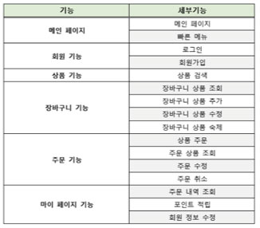  
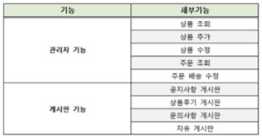

     

## :clipboard: 요구사항명세서

### :unlock: 사용자
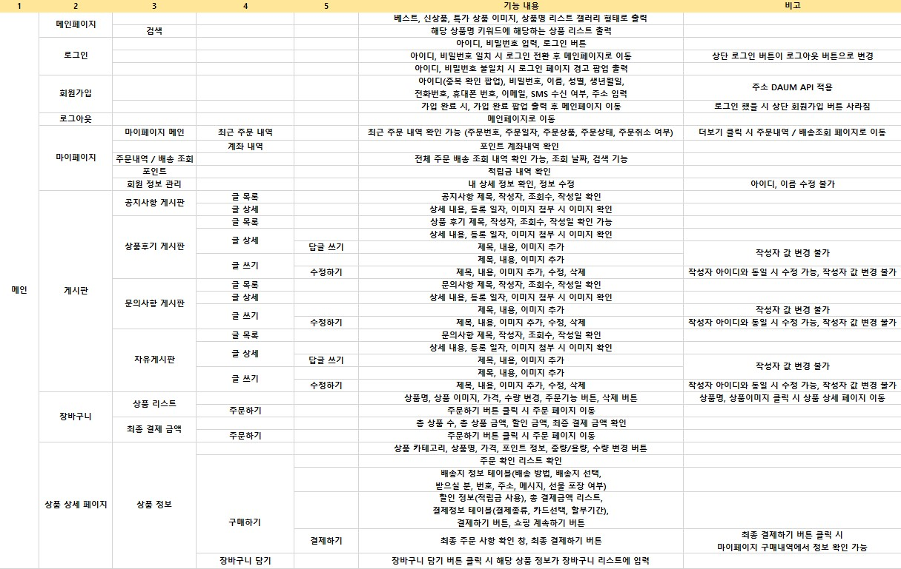

### :lock: 관리자
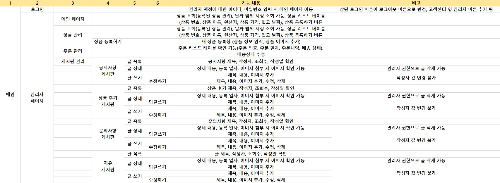
    
     
 
## :file_folder: 발표 자료

https://www.miricanvas.com/v/11pnl9f :point_left:
    
    
     
 
## :computer: 서비스 내용

  

### :unlock: 사용자 (회원가입)
 

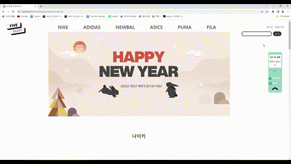

  

### :unlock: 사용자 (로그인)
 

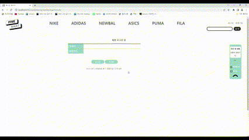

  

### :unlock: 사용자 (게시판글쓰기)
 

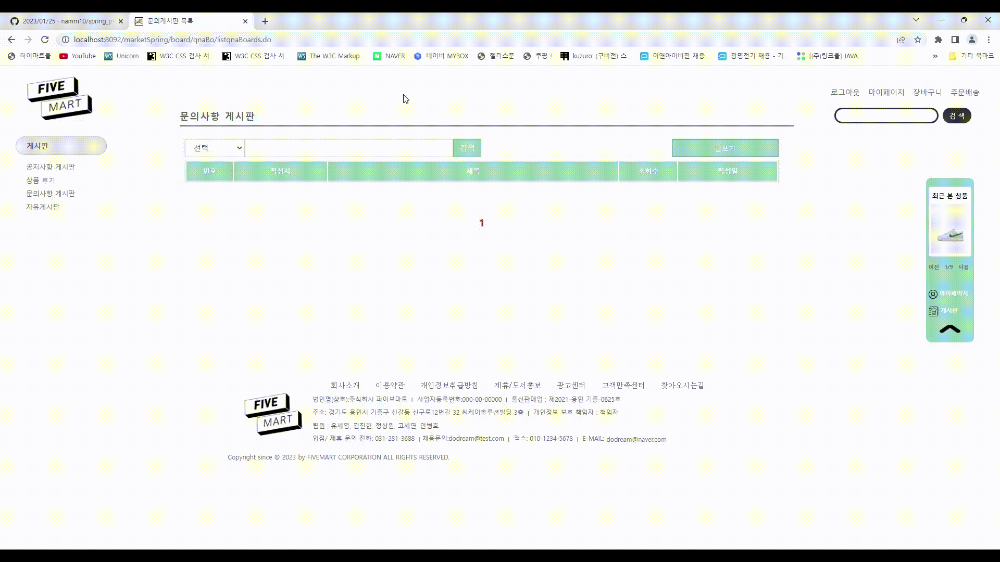

  

### :unlock: 사용자 (게시판삭제)
 

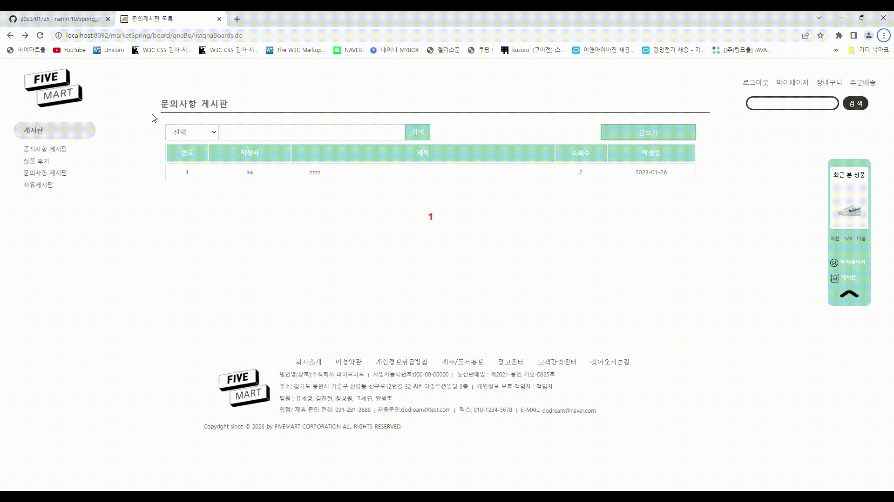

  

### :unlock: 사용자 (마이페이지 및 회원정보)
 

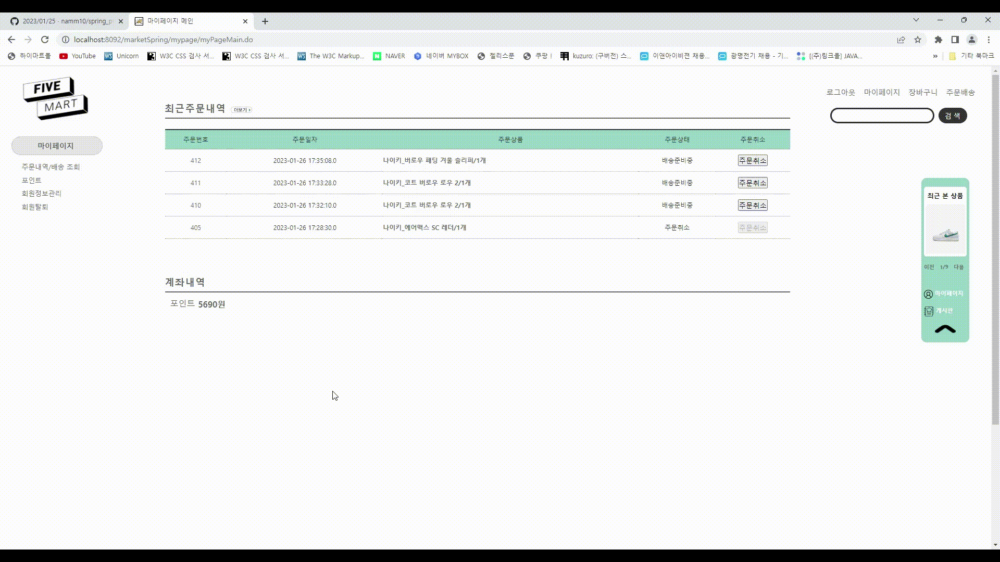

  

### :unlock: 사용자 (주문)
 

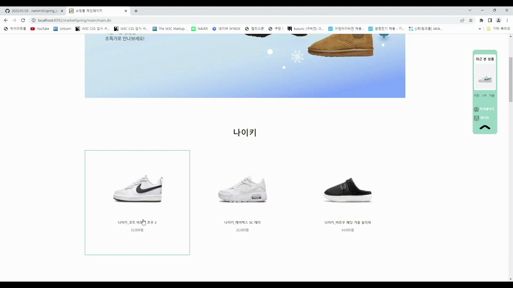

  

### :lock: 관리자 (로그인)
 

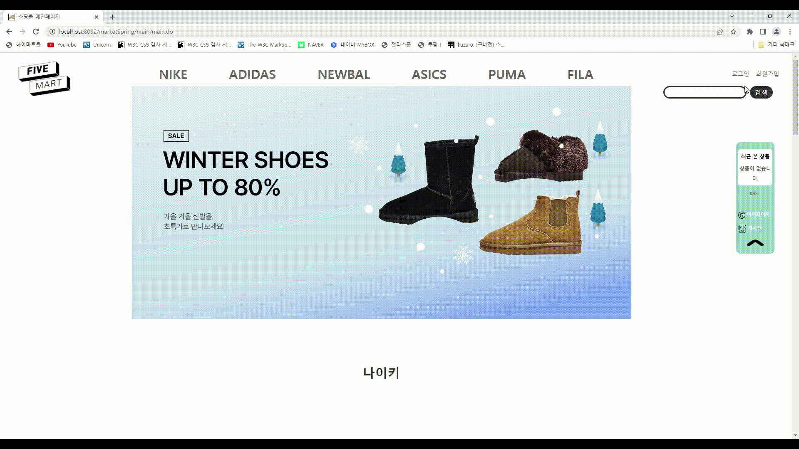

  

### :lock: 관리자 (상품등록)
 

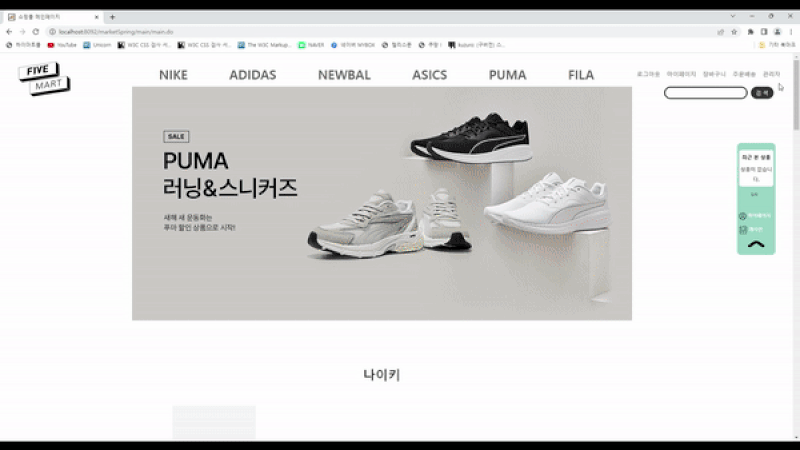

  

### :lock: 관리자 (상품이미지수정)
 

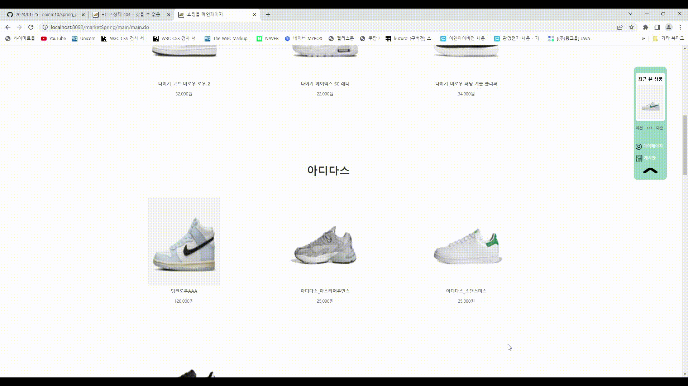

  

### :lock: 관리자 (상품내용수정)
 

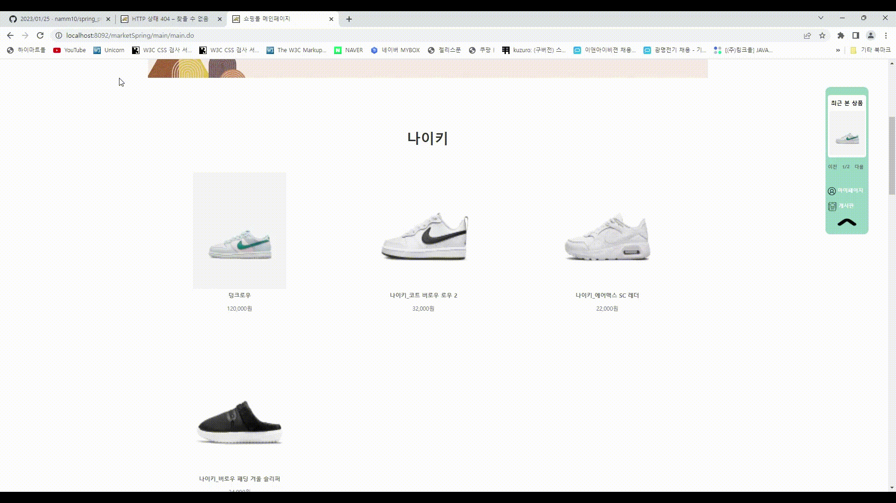

     

## :tv: TOTAL REVIEW  

https://clipchamp.com/watch/lHtRYz638N6 :point_left:

     

## :sparkles: 다이어그램

  

### 유스케이스 다이어그램
 

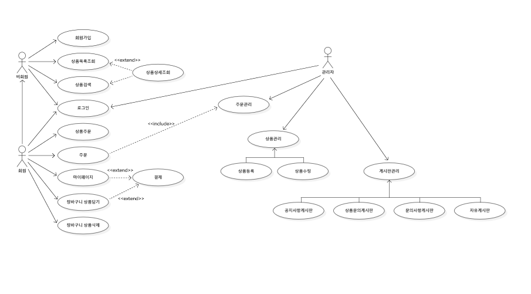

  

### 시퀀스 다이어그램
 

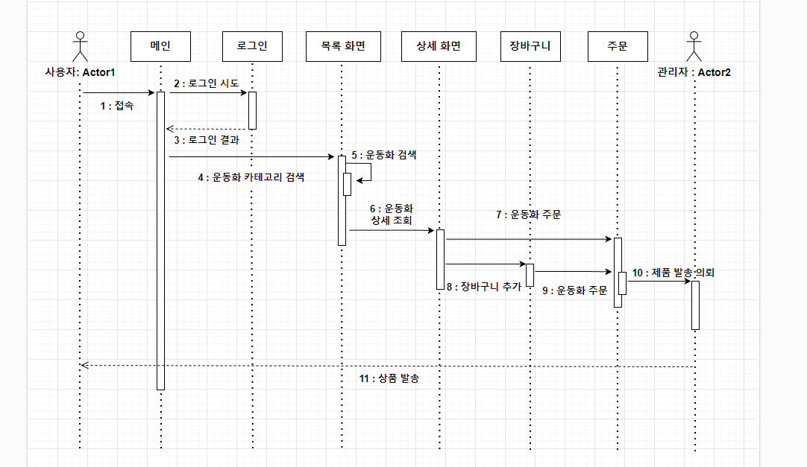

  

### ERD
 

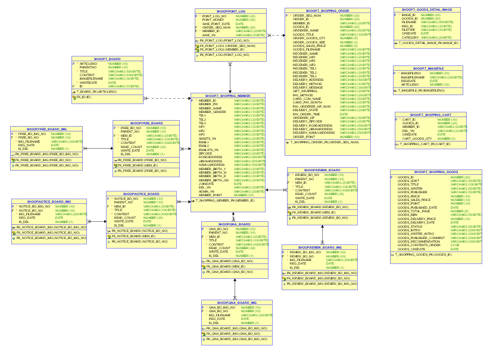

  

